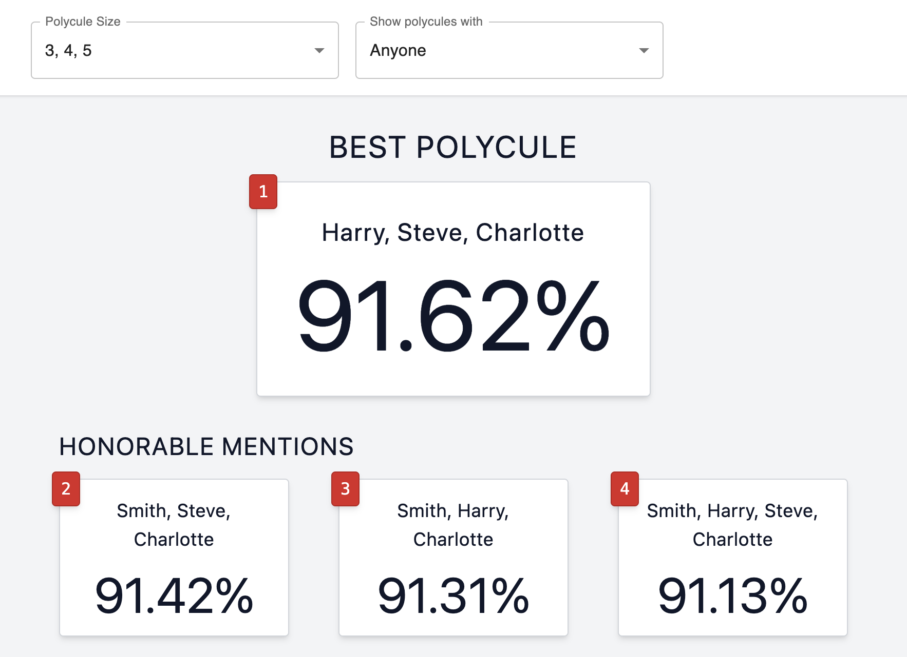

# Sex and the City: The Polycule Compatibility Calculator

It's time to _disrupt polyamory_.

## The Story

Sex and the City is an iconic show that ran from 1998 to 2004. A cultural phenomenon and trailblazing show at the time, depicting social life, sex, and relationships through a lens rarely seen at that time.

But it had one fatal flaw. It was based on the assumption that each protagonist could only end up with _one_ person.

I couldn't help but wonder... what if each person could be in an ethically and consenting relationship with more than one person at a time? What would the ideal polycule be? How would we even calculate that? These are the questions society needs to be asking. These are the real problems VCs should be investing in. If we put a man on the moon we can settle once and for all who Carrie _actually_ should have ended up with.

## Local Development

1. Clone this repo
2. Run `yarn install`
3. Run `yarn start`
