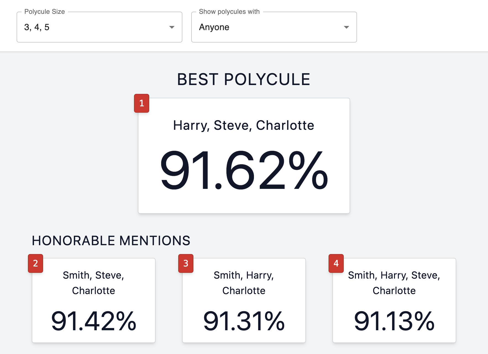

# Sex and the City: The Polycule Compatibility Calculator

And just like that... [Explore the polycules.](https://satc-polycules.netlify.app/)

## The Story

Sex and the City is an iconic show that ran from 1998 to 2004. It was a cultural phenomenon and trailblazing show at the time, depicting social life, sex, and relationships through a lens rarely seen at that time.

But it had one fatal flaw: it was based on the assumption that each protagonist could only end up with **one** person.

I couldn't help but wonder... what if each person could be in an ethically and consenting relationship with more than one person at a time? What would the ideal polycule be? How would we even calculate that? These are the questions society needs to be asking! These are the real problems VCs should be investing in! Dare I say, if we put a man on the moon we can settle once and for all who Carrie **actually** should have ended up with.

## Local Development

1. Clone this repo
2. Run `yarn install`
3. Run `yarn start`

## The Methodology

The core assumption behind this whole algorithm is that compatible relationships can be broken down into a set of characteristics. So the first step was to figure out what those characteristics are. I did a quick Google search for "relationship characteristics" and clicked on the very first link I got at the time, which opened an article on ["The 14 Most Important Characteristics of Healthy Relationships"](https://www.mindbodygreen.com/articles/characteristics-of-healthy-relationships). I took those 14 characteristics as fact and used them as the entire basis of this algorithm.

But wait, you ask, that's all the research I did? No thorough literature review? No citations of academic papers to back up this choice? You're damn right I did none of that. The goal of this project was to come up with an algorithm to calculate polycule compatibility. Theoretically that means the exact relationship traits are replaceable as long as the math is sound. If you don't agree with my choice of successful relationship traits, just fork the repo and choose your own! If that upsets you, remind yourself you are looking at a repo about "Sex and the City" polycule calculations. Scientific rigor was not exactly top of mind and if you made it this far into the readme then your decision-making skills are already questionable enough and you and I are more alike than you think.

So let's begin!

### General equation

Let's assume we have $N$ traits and the polycule can receive a score on each of those traits. A trait is something like "honesty" or "respect for each other" and we're assuming that a polycule's "performance" on this trait can be represented as a single number. If we're assuming that the chosen $N$ traits are indeed conducive to successful relationships, then let's define the Polycule Compatibility Score across $N$ traits, denoted by $C_N$, as the average of how good a polycule is across the $N$ traits conducive to a healthy relationship.

$$
C_N = \frac{1}{N} \sum_{N}^{i=1} X(i)
$$

Where $X(i)$ is the polycule's score on the $i$th trait. So now the task has simplified to: **how do you calculate a polycule's score for a single trait?**

### Calculating a polycule's score on a single trait

Now let's assume there are $K$ partners in the polycule (a $K$-cule, if you will). Now let's assume that each individual has a score for each trait. For example, each individual now has an honesty score or an affectionate score. These scores will need to be assumed and you can explore the [constants.ts](https://github.com/jps327/satc-polycule-app/blob/main/src/constants.ts) file to see the scores I gave each "Sex and the City" character on each trait. If you disagree with my scores, please do **not** open a github issue or pull request. I am not taking feedback on this. My mind is made up.

Let $T(i, j)$ be the $i$th trait score for the $j$th individual, where scores are between 0 and 1 (inclusive). The Polycule Compabibility Score for a $K$-cule across $N$ traits, denoted by $C_{K,N}$, can be represented as:

$$
C_{K,N} = \frac{1}{N} \sum_{i=1}^{N} \Bigg( \frac{1}{K} \sum_{j=1}^{K} T(i,j) \Bigg)
$$

But this is a naive equation because it just assumes that a polycule's score on a trait is just the average of each partner's individual score. All this really tells us is the average **individual** performance on a trait, not the **polycule's** performance on this trait. We need some way to quantify how a partner's performance on a trait can affect their partners. To do this, we'll add the concept of "importance" of a trait.

Each individual will now have both a performance score for a given trait and a measure of how important it is to them that their partner exhibit this trait. The argument here is that if a trait is very important to someone, being less than perfect on that trait should have a negative effect on the polycule's score. And vice versa, if a trait is very unimportant to someone, it doesn't matter how bad others are at that trait, it won't really affect the polycule's health.

Let $I(i, j)$ be how important it is for the $j$th person that a partner of theirs be good at the $i$th trait. For simplicity, let's assume importance is measured with a 5-point likert scale (the reasoning is that one day this app might be extended to let you score yourself, and it is easier for people to think in likert scales). So $I(i, j) \in {0, 0.25, 0.5, 0.75, 1}$.

Perosnally, if asked, I don't think that we coneptualize "importance" in a linear scale. I think it's closer to a bell curve. Most people will see the importance of a trait somewhere between "important" or "unimportant," but the extremes ("extremely important" or "extremely unimportant") are a lot less common. So we need some way to convert the importance score to a percentile. What we really want to know is, given an importance value $I(i, j)$, what percentile of the general population am I in how important I see that trait? That "importance percentile" should be the true "importance score."

Ideally, we'd have some representative sample of the general population where everybody has been asked to score how important each trait is to them. From there, we can get an empirical distribution of importance ratings. Since I haven't done any such survey, I made up a normal distribution that had a curve I liked and made me go "yeah, that's it." So let's assume that $G(x) = P(X \leq x)$ where $X$ is the population's distribution of importance ratings, such that $X \sim N(0.5, 0.3035^2)$ (in other words, I'm assuming that the average importance of any trait is 0.5 with a standard deviation of 0.3035). There is no scientific basis behind this other than vibes.

So now that we have a non-linear representation of "importance," our new equation is:

$$
C_{K,N} = \frac{1}{N} \sum_{i=1}^{N} \Bigg( \frac{1}{K(K-1)} \sum_{j=1}^{K} \sum_{k=1,j \neq k}^{K} T(i,k) ^{2G(I(i,j))} \Bigg)
$$

Each individual trait score is now exponentiated by 2 times the importance percentile. The exponentiation is a convenient to reduce a score if the importance percentile is high, but increase a score if the importance percentile is low. So now, the worse partners are at important traits, the lower the score will be. The nested loop lets us capture all pairwise interactions in the $K$-cule, so one person's performance on an individual trait may have a good score for one partner but a low score for another partner, depending on how important that trait is to those partners.

To simplify, we will define $\gamma_{i,j,k}$ as the pairwise trait score between person's $j$ and $k$ on trait $i$, as follows:

$$
\gamma_{i,j,k} = T(i,k) ^{2G(I(i,j))}
$$

So the $K$-cule compatibility can be shortened to:

$$
C_{K,N} = \frac{1}{N} \sum_{i=1}^{N} \Bigg( \frac{1}{K(K-1)} \sum_{j=1}^{K} \sum_{k=1,j \neq k}^{K} \gamma_{i,j,k} \Bigg)
$$

### Rewarding good behavior

Up until now the scoring equation has been purely punitive. Any individual trait score that is less than perfect will invariably reduce the polycule's overall score. The only way to get a perfect 100% compatibility is to be perfect at every trait (or for everyone to find each trait 0% important). This isn't realistic though. I'd like to think that a relationship isn't just a series of dealbreakers and if "Sex and the City" taught me anything it's that you don't need to be perfect to find happiness.

There has to be some way to boost your score if you are good at a trait that is important to your partner. For example, if honesty is really important to me and I have a very honest partner, that should give our compatibility a boost! So let's introduce a "You-did-good" reward function. What this function should do is that if a trait is important enough, we should figure out how far away a pairwise trait score was from perfect, and add back some of that score (scaled by some factor).

So I am going for a threshold-based reward function, denoted $\phi(i, j, k)$, where:

$$
\phi(i,j,k) = \left\lbrace \begin{array}{ll}
     (1 - \gamma_{i,j,k}) R & \text{if } I(i, j) > 0.5 \\
     0 & \text{if } I(i, j) \leq 0.5
 \end{array} \right.
$$

So the reward function is only added if a trait's importance is greater than 0.5 (i.e. it is more than "meh" importance). $R$ is some reward scaling factor which we will use to scale the distance between the pairwise score and the perfect score of 1. That scaled distance will then be added back as a "reward" to the pairwise score. Theoretically, if $R = 1$ then you are rewarded the entire distance your pairwise score had from perfect (i.e. your new score is now a perfect 1). The lower $R$ is, the less of that distance you will be rewarded.

After a lot of tinkering and trial and error with plots, I landed on:

$$
R = T(i, k)^3G(I(i, j))
$$

Why? You guessed it. I liked the curve. It made me go "ooooohhh."

The reasoning here is that being "rewarded" should be difficult, because you have to be **really** good at something that your partner **really** cares about. We shouldn't just be rewarding mediocre behavior on barely important traits! So that's why we cube $T(i, k)$ (instead of squaring it). A cube exponent on values between 0 and 1 has a faster dropoff than a squared one. We then multiply by the importance percentile $G(I(i, j))$ to reduce the reward even more if the importance percentile is lower. If I am at the highest percentile 1 then $R$ will be the full $T(i, j)^3$ factor. But if my percentile is, say, 0.5, then $R$ will also be halved. In other words, the less important the trait is, the less you are rewarded for being good at it.

So our new equation is:

$$
C_{K,N} = \frac{1}{N} \sum_{i=1}^{N} \Bigg( \frac{1}{K(K-1)} \sum_{j=1}^{K} \sum_{k=1,j \neq k}^{K} \Bigg( \gamma_{i, j, k} + \phi(i, j, k)
\Bigg) \Bigg)
$$

### Chaotic energy factor

We're almost there! Until now, we've represented a polycule's compatibility as the average of all pairwise compatibilities. This is a reasonable start, but it implies that a polycule is just a sum of 2-person relationships, which is inaccurate. Anybody who's watched [Steven Universe](https://en.wikipedia.org/wiki/Steven_Universe) understands that a relationship is not just the sum of its parts, but is also holistically it's own distinct entity. Therefore, we need some way to quantify the $K$-cule's holistic energy, without relying on pairwise interactions.

Let's imagine a $K$-cule as an atom, where the nucleus is the relationship itself and the protons in the nucleus are the polycule partners. How "stable" is this nucleus? If a proton strongly pulls away from the others or if the protons are repelling each other too much, the nucleus becomes more unstable and is more likely to decay. The polycule becomes less compatible. If we can quantify how chaotic (or stable) a polycule is, which we'll call the Chaotic Energy Factor, $E$, we can scale the full polycule's average pairwise score by this factor.

Rather than relying on quantum physics to measure stability, I decided to make my life easier and turn to basic statistics and use a mean squared error (MSE). Let's assume that the MSE of a $K$-cule's trait scores is a good proxy for a polycule's stability. Why? Well, imagine a polycule where everyone has similar levels of honesty. That feels pretty stable, right? Now imagine one where everyone is similar except for 1 person who is an honesty wildcard. Feels a little bit more chaotic now. Now imagine one where everyone has **very** different honesty scores, so the MSE is quite large. Feels quite chaotic, right? Great! Our assumption passes the vibe check.

Lastly, we still want to consider the average importance of this trait. For example, let's say we have high MSE in affectionate scores, but if the polycule on average doesn't give much importance to being affectionate then this variance doesn't matter as much. So we will modulate the MSE of a trait by how important that trait is.

Let $T_{avg}(i)$ and $I_{avg}(i)$ be the average trait score and average importance, respectively, for the $i$th traits among all partners in the polycule. The Chaotic Energy Factor is given by:

$$
E = \Big(1 - \frac{1}{K}\sum_{j=1}^{K} (T(i, j) - T_{avg}(i)^2 \Big)^{2 I_{avg}(i)}
$$

### And just like that...

The final Polycule Compatbility Score equation is:

$$
C_{K,N} = \frac{1}{N} \sum_{i=1}^{N} \Bigg( \frac{E}{K(K-1)} \sum_{j=1}^{K} \sum_{k=1,j \neq k}^{K} \Bigg( \gamma_{i, j, k} + \phi(i, j, k)
\Bigg) \Bigg)
$$
